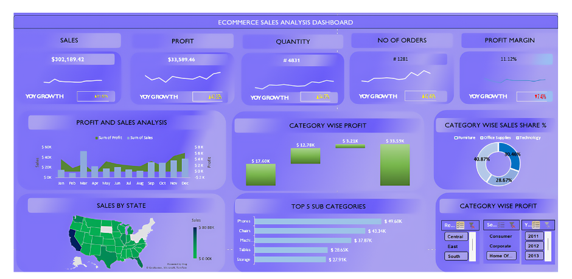

# E-commerce Sales Analysis Dashboard

## Overview
This project is a dynamic Excel dashboard designed to analyze e-commerce sales data. The dashboard provides insights into various sales metrics, profit margins, and category-wise performance, enabling effective decision-making.

## Introduction
The E-commerce Sales Analysis Dashboard is a comprehensive tool for visualizing and analyzing sales data. It includes various interactive components that allow users to filter and drill down into specific data points, providing a clear view of the overall sales performance and profitability.

## Features
- **Total Sales**: Displays total sales with year-over-year (YOY) growth.
- **Total Profit**: Shows total profit along with YOY growth.
- **Quantity Sold**: Indicates the total quantity sold with YOY growth.
- **Number of Orders**: Total orders processed and YOY growth.
- **Profit Margin**: Overall profit margin percentage with YOY growth.
- **Profit and Sales Analysis**: Monthly profit and sales data visualization.
- **Category-wise Analysis**: Profit and sales share percentage by category.
- **Top 5 Sub Categories**: Sales data for the top 5 sub-categories.
- **Filterable Category Wise Profit**: Interactive filters for region, customer segments, and years.

## Getting Started
Follow these instructions to set up and use the dashboard on your local machine.

### Prerequisites
- Microsoft Excel 2016 or later

## Development Steps
1. **Data Collection and Preparation**
   - Collect and clean e-commerce sales data.
   - Ensure data consistency and format compatibility for Excel.

2. **Setting Up the Excel Workbook**
   - Create a new Excel workbook.
   - Import the cleaned data into separate sheets as needed.

3. **Dashboard Layout Design**
   - Design the layout with placeholders for various metrics and charts.
   - Use a consistent color scheme for better visual appeal.

4. **Creating Metrics and Charts**
   - **Sales, Profit, Quantity, Orders, and Profit Margin**:
     - Use formulas to calculate totals and YOY growth.
     - Insert line charts for visual representation of YOY growth.
   - **Profit and Sales Analysis**:
     - Create a combination of bar charts for monthly sales and profit data.
   - **Category-wise Analysis**:
     - Develop bar and pie charts to display profit and sales share.
   - **Top 5 Sub Categories**:
     - Use bar charts to show sales data for the top sub-categories.
   - **Sales by State**:
     - (If applicable) Create a map or bar chart for sales by state.
   - **Filterable Category Wise Profit**:
     - Set up pivot tables and charts.
     - Add slicers for regions, customer segments, and years to make the data filterable.

5. **Adding Interactivity**
   - Use slicers to allow users to filter data dynamically.
   - Ensure charts and tables update based on slicer selections.

6. **Testing and Validation**
   - Verify all calculations and chart data.
   - Test interactivity and ensure smooth functionality.

7. **Final Touches**
   - Add titles and labels to all charts.
   - Ensure all elements are aligned and visually coherent.
   - 
## Dashboard

## Usage
1. Open the Excel dashboard file.
2. Use the slicers to filter data by regions, customer segments, and years.
3. Review the charts and metrics to gain insights into e-commerce sales performance.
4. Note the warnings for charts not available in your Excel version and consider updating Excel if needed.

## Contributing
Contributions are welcome! Please open an issue or submit a pull request with your changes.

1. Fork the repository.
2. Create your feature branch (`git checkout -b feature/AmazingFeature`).
3. Commit your changes (`git commit -m 'Add some AmazingFeature'`).
4. Push to the branch (`git push origin feature/AmazingFeature`).
5. Open a pull request.

By following this guide, you can set up and utilize the E-commerce Sales Analysis Dashboard for comprehensive data analysis and insights.
